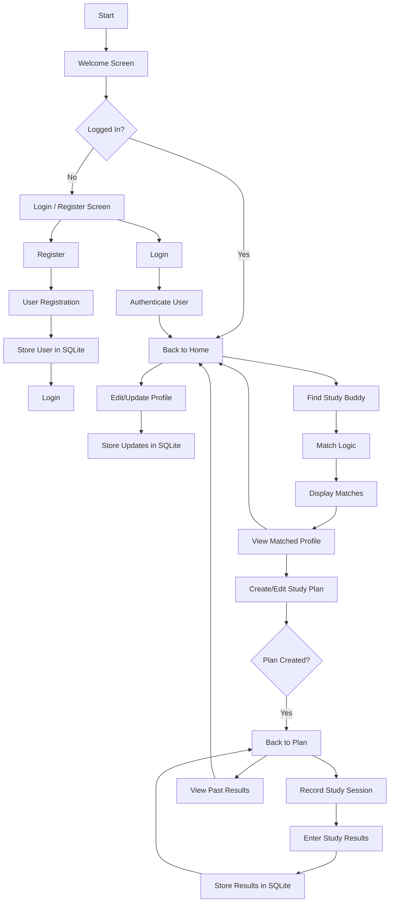
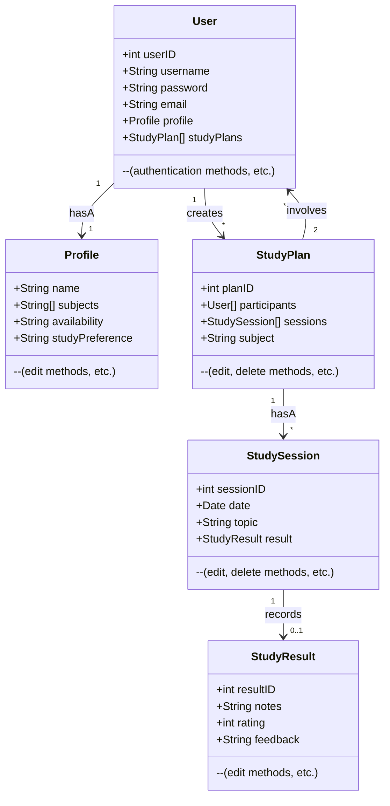

# App Flow



# Class Design



---------------------------

```lua
StudyBuddyApp/
|-- src/
|   |-- main/
|   |   |-- java/
|   |   |   |-- com/
|   |   |   |   |-- studybuddy/
|   |   |   |   |   |-- models/
|   |   |   |   |   |   |-- User.java
|   |   |   |   |   |   |-- Profile.java
|   |   |   |   |   |   |-- StudyPlan.java
|   |   |   |   |   |   |-- StudySession.java
|   |   |   |   |   |   |-- StudyResult.java
|   |   |   |   |   |-- utils/
|   |   |   |   |   |   |-- DatabaseHelper.java  
|   |   |   |   |   |   |-- AuthenticationHelper.java
|   |   |   |   |   |-- activities/
|   |   |   |   |   |   |-- MainActivity.java
|   |   |   |   |   |   |-- LoginActivity.java
|   |   |   |   |   |   |-- RegisterActivity.java
|   |   |   |   |   |   |-- StudyPlanActivity.java
|   |   |   |   |   |   |-- StudySessionActivity.java
|   |   |   |   |   |   |-- StudyResultActivity.java
|   |   |   |   |   |-- adapters/
|   |   |   |   |   |   |-- StudyPlanAdapter.java
|   |   |   |   |   |   |-- StudySessionAdapter.java
|-- res/
|   |-- layout/
|   |   |-- activity_main.xml
|   |   |-- activity_login.xml
|   |   |-- activity_register.xml
|   |   |-- activity_study_plan.xml
|   |   |-- activity_study_session.xml
|   |   |-- activity_study_result.xml
|-- gradle/

```

